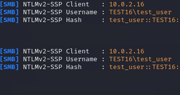

# Утечка учётных данных через CVE-2025-24071
*Дмитрий Лифанов*

В мартовском обновлении безопасности Microsoft Windows была устранена уязвимость CVE-2025-24071, которая может привести к утечке учётных данных через механизм обработки файлов при индексации. После исправления этой уязвимости в открытых источниках была описана соответствующая [техника атаки](https://cti.monster/blog/2025/03/18/CVE-2025-24071.html). Рассказываем, в чём заключается атака и как её детектировать.

Формат .library-ms является доверенным для Windows Explorer, так как используется для определения расположения библиотек. После распаковки такого файла из RAR/ZIP-архива система автоматически парсит и индексирует содержимое файла для того, чтобы правильно отображать иконки, превью и метаданные.   

Атакующий может создать вредоносный файл .library-ms, содержащий в себе секцию <simpleLocation> со ссылкой на контролируемый SMB-сервер, поместить его в архив и направить жертве:


 
В момент распаковки архива произойдет автоматическая обработка файла .library-ms с целью сбора метаданных для индексации, что приведет к попытке разрешить удалённый узел и обратиться на указанный в секции <simpleLocation> путь.

Такое действие приводит к неявной для пользователя попытке NLTM-аутентификации на целевом узле, вследствие чего атакующий может получить NetNTLM-хэш жертвы и далее использовать для своих целей. Пример для атаки с обращением на локальный узел:
 


Данный сценарий работает как для локальной инфраструктуры, так и для внешних адресов, при условии наличия сетевой связанности между узлами. Вот пример для атаки с обращением на внешний узел:


 
Дополнительно к этому будут произведены попытки обращения с использованием WebDAV. В случае с использованием responder на стороне атакующего это приведёт к попытке отправить запрос на NTLM-аутентификацию жертве. В различных сценариях аутентификация может произойти успешно либо завершится многократными попытками отправки запроса без успешной аутентификации. При этом на стороне пользователя данная активность не вызовет никаких диалоговых окон, запрашивающих учётные данные.
 

 


Также стоит отметить, что данный сценарий может воспроизводиться в случае размещения .library-ms файла в различных каталогах и выполнения действий над ним. Например, размещение файла на рабочем столе пользователя приведёт к тому, что в момент входа и загрузки рабочего стола будет происходить аналогичный запрос и сетевое взаимодействие, где источником будет процесс COM-сервера, отвечающего за генерацию кэша эскизов: 
```C:\Windows\system32\DllHost.exe /Processid:{AB8902B4-09CA-4BB6-B78D-A8F59079A8D5}```

## Как предотвратить попытки эксплуатации данной уязвимости:

- Запретить на почтовом сервере и почтовых клиентах возможность получения и обработку файлов .library-ms.
- Отслеживать сетевые обращения по SMB на внешние IP-адреса и узлы.
- В сценарии с размещением файла на рабочем столе сетевое взаимодействие будет инициировано от COM-сервера Thumbnail Cache Class Factory for Out of Proc Server, отвечающего за генерацию экзизов. Инициатором обращения в таком случае будет Dllhost.exe, содержащий в командной строке CLSID данного COM-сервера:
```C:\Windows\system32\DllHost.exe /Processid:{AB8902B4-09CA-4BB6-B78D-A8F59079A8D5}```
- Большинство приложений для взаимодействия с WebDAV-серверами используют системный сервис WebClient. Поэтому стоит обращать внимание на внешние соединения инициированные через ```C:\WINDOWS\system32\svchost.exe -k LocalService -p -s WebClient```, содержащий в user-agent параметр Microsoft-WebDAV-MiniRedir/* и метод обращения PROPFIND. 
- Также данная активность может быть обнаружена за счет параметров запуска rundll32.exe с загрузкой библиотеки davcInt.dll и при обращении к именнованному каналу DAV RPC SERVICE: 
```rundll32.exe C:\Windows\system32\davclnt.dll,DavSetCookie 10.0.2.20 http://10.0.2.20/testshare``` 
Такая активность требует некоторой фильтрации в инфраструктуре, т.к. легитимные приложения используют аналогичный сценарий взаимодействия;
- В некоторых сценариях может происходить обращение напрямую без использования сервиса WebClient. Например, исполняемый процесс WinRAR может произвести обращение к целевому узлу, в user-agent такого обращения будет значится DavClnt;
- Отслеживать появление в системе файлов .library-ms, созданных процессами архиваторов, почтовых клиентов, браузеров и процессами из [LOLBin](https://lolbas-project.github.io/).
- Ограничить исходящий NTLM-трафик политикой: 
Computer Configuration > Administrative Templates > System > Net Logon > Network security: Restrict NTLM: Outgoing NTLM traffic to remote servers.
